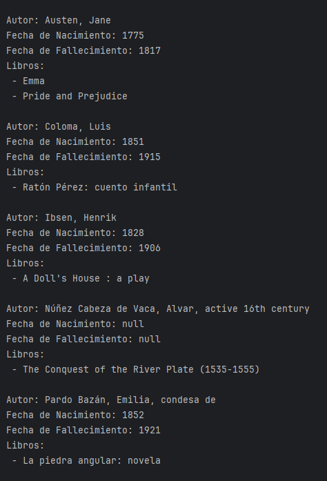

# Literalura

Literalura es un proyecto desarrollado como parte del Alura Challenge, que permite la gestión de libros y autores utilizando datos de Gutendex.

## Tabla de Contenidos

1. [Descripción](#descripción)
2. [Funcionalidades](#funcionalidades)
3. [Requisitos](#requisitos)
4. [Instalación](#instalación)
5. [Uso](#uso)
6. [Contribución](#contribución)
7. [Licencia](#licencia)
8. [Capturas de Pantalla](#capturas-de-pantalla)

## Descripción

Literalura es una aplicación construida con Java y Spring Boot que facilita la búsqueda, almacenamiento y gestión de libros y autores. Permite realizar búsquedas por título de libro, listar libros y autores registrados, filtrar libros por idioma, y mucho más.

## Funcionalidades

- **Buscar libro por título (WEB)**: Permite buscar libros en la web utilizando la API de Gutendex.
- **Listar libros registrados**: Muestra todos los libros almacenados en la base de datos.
- **Listar autores registrados**: Muestra todos los autores almacenados en la base de datos.
- **Listar autores vivos en un determinado año**: Permite filtrar y mostrar autores que estaban vivos en un año específico.
- **Listar libros por idioma**: Permite filtrar y mostrar libros por idioma.

## Requisitos

- JDK 11 o superior.
- Maven (para compilar y gestionar dependencias).
- Base de datos compatible con Spring Boot (H2, MySQL, PostgreSQL, etc.).

## Instalación

1. Clona el repositorio: `git clone https://github.com/tu_usuario/literalura.git`
2. Navega al directorio del proyecto: `cd literalura`
3. Compila el proyecto: `mvn clean package`
4. Ejecuta la aplicación: `java -jar target/literalura.jar`

## Uso

Una vez que la aplicación esté en ejecución, accede a través del navegador a `http://localhost:8080` (o el puerto configurado) para interactuar con la interfaz de usuario.

Utiliza el menú principal para navegar por las diferentes funcionalidades:

### Menú Principal

- **1 - Buscar libro por título (WEB)**: Ingresa el título del libro que deseas buscar.
- **2 - Listar libros registrados**: Muestra una lista de todos los libros almacenados.
- **3 - Listar autores registrados**: Muestra una lista de todos los autores almacenados.
- **4 - Listar autores vivos en un determinado año**: Ingresa el año para filtrar autores vivos en ese período.
- **5 - Listar libros por idioma**: Selecciona un idioma para filtrar y mostrar libros.
- **0 - Salir**: Cierra la aplicación.

## Contribución

Si deseas contribuir a Literalura, sigue estos pasos:

1. Haz un fork del repositorio.
2. Crea una nueva rama para tu funcionalidad: `git checkout -b nueva-funcionalidad`.
3. Realiza tus cambios y haz commit de ellos: `git commit -am 'Añade nueva funcionalidad'`.
4. Sube los cambios a tu repositorio: `git push origin nueva-funcionalidad`.
5. Envía un Pull Request para revisar los cambios.

## Capturas de Pantalla

### Menú Principal

### Búsqueda de Libros

### Listado de Libros

### Listado de Autores

### Filtrar Libros por Idioma

---